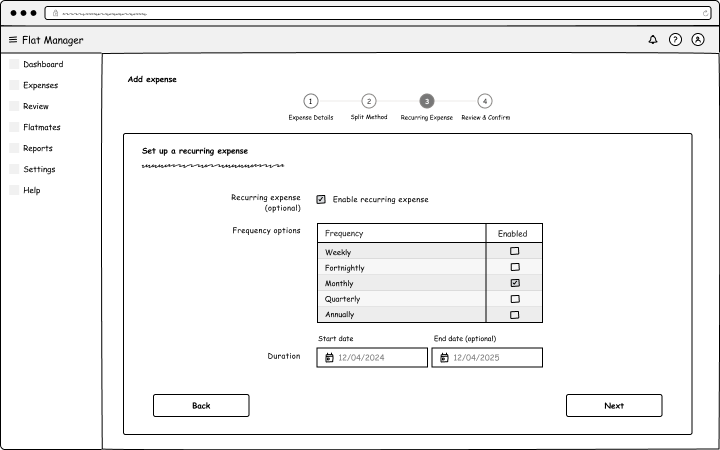
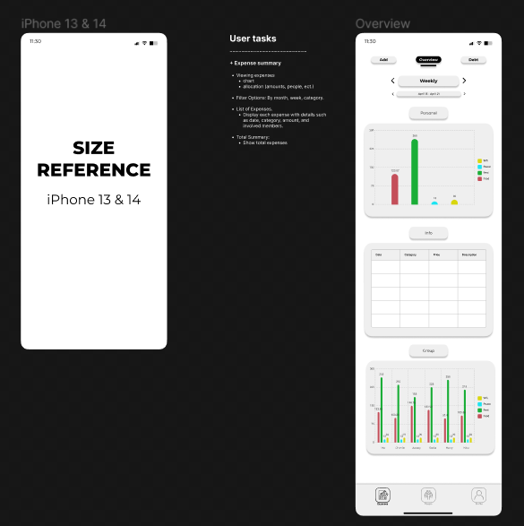

# Design Ideation

## Introduction
This section documents the ideation process for our app prototype. It includes the original designs from Assignment 2 and the subsequent revisions and iterations that led to our final design choices.

## Original Designs from Assignment 2

### Felix Vidal:

This section presents the various designs (wireframes and user flows) that were developed for Assignment 2. While I did not fully grasp the brief initially, resulting in the creation of design layouts for three specific tabs rather than comprehensive wireframes, I still considered the necessary elements during the design process.

Expenses Tab
In the Expenses tab, a navigation bar at the top includes the following tabs: Expenses (current view), Statistics, Settings, and Profile. This navigation bar is set against a blue background, creating a header that frames the app and improves visual clarity. A prominent blue plus sign button, located at the bottom right corner for easy access with the right thumb, serves as the main button for adding a new expense. The Expenses tab displays a chronological history of all expenses, each entry featuring an icon, name, date, and amount of the expense. A search bar at the bottom, which slides up to reveal a keyboard, allows users to search for specific expenses and filter results by type or amount.

Add Expense Tab
When the user clicks the blue plus button, the Add Expense tab appears. The navigation bar disappears for a cleaner view, but the header remains with "Add Expense" displayed, indicating the current function. An arrow icon allows users to return to the Expenses tab. This tab includes fields for entering the name, amount, date, and a note for the expense. Additionally, there is a checkbox labeled "Split Expense?" for users who want to divide the cost among multiple people. A large blue "Save" button at the bottom ensures visibility and encourages users to save the expense rather than accidentally navigating back.

Split Expense Feature
If the user selects the "Split Expense?" checkbox, the Add Expense tab expands to include additional fields. A search bar appears, allowing the user to find and select people to split the expense with. Selected individuals are displayed in a list below the search bar, with the most recently added person at the top. The default setting evenly distributes the expense amount among the selected people, but users have the option to input specific amounts or percentages for each person. This flexibility reduces the need for manual input while allowing for customization if needed.
These designs aim to streamline the user experience by making key functions easily accessible and ensuring the interface is intuitive and efficient.

### Dillon Sykes:

#### Dashboard Page
- **Description:** Upon first logging into the system, the user is presented with the Dashboard page. This page prominently displays the two most important details to the user (how much is owed to you, and how much is owed by you) along with arrows for a simple visual indicator differentiating between the two reducing the mental load required. Just below these two important core statistics are their related quick action buttons to directly navigate to either the expense payment or expense creation pages. Lastly, a basic activity line graph showing an historic overview and a recent expenses table are included.

#### Add Expense Page (Wizard Step 1)
- **Description:** The user is taken directly to the expense creation wizard upon using one of the two quick buttons. This is a multi-step wizard that breaks up the expense information into chunks to prevent the user from being overwhelmed with a vast amount of settings and required details. This first step is to input the main details of the expense and including context if required for other flatmates. Files can also be uploaded, such as PDF invoices.

#### Add Expense Page (Wizard Step 2)
- **Description:** The user is asked to select the method that should be used to split the expense with small descriptions. As Alex is paying the larger share of the bill, he has chosen the “Fixed” option which allows him to manually specify a fixed cost value per flatmate. With this option selected, the flatmate list to specify the cost values and with which flatmates is presented.

#### Add Expense Page (Wizard Step 3)
- **Description:** The user is provided the option to set the expense as recurring with various options on how to schedule it. This prevents the user from having to manually re-create expenses in scenarios where the expense might be consistent and at the same fixed cost or settings provided by the user during the expense creation wizard. Examples for recurring expenses include things such as rent and internet bills. In the user task scenario, Alex won’t have to create this expense 12 times over the next year and aligns with his persona where he values efficiency.

#### Add Expense Page (Wizard Step 4)
- **Description:** Finally the user is asked to confirm everything is correct, the information here is not editable but they’re able to use the back button to change the information they previously entered within the wizard. Upon submitting, the user is then sent to the “Expenses” page and receives a notification that the expense was successfully created.

#### Assigned Expenses Page
- **Description:** This page contains all expenses assigned to you as a flatmate. Expenses you do not need to pay a portion of (such as groceries shared between two other flatmates) are not shown as this is irrelevant. This ensures clutter is kept at a minimum while making the app relevant to each individual flatmate. This page is accessed by clicking on “Expenses” in the navigation. The expense “Pay Now” button launches a pop-up with basic information about the expense and what is owed by you, allowing you to quickly pay this. The “Details” button takes the user to the comprehensive expense details page that contains all the details that were entered when the expense was created.

#### Expense Details Page
- **Description:** The page also allows the viewing of PDF files that were attached (invoices and bills are commonly formatted in PDF). Presenting PDF files in this way improves the user experience by reducing the number of steps needed to access required information. The user flatmate is also able to see who has paid the expense and can “Mark as Paid” directly from the details page to prevent having to go back to the main “Expenses” page to click “Pay Now”.

#### Mark Expense As Paid (Pop-Up)
- **Description:** The user must provide a date and payment amount when marking as paid, this helps the expense creator (receiving the money) efficiently locate the transaction in their bank account in order to to be able to verify it. This significantly reduces frustration when needing to lookup several bank transactions.

#### Expenses Page (After Marking Expense As Paid)
- **Description:** The user is able to see visual indications of each payment status based on the action buttons and “Flatmates Paid” table column, in the latter the user can visually observe how many flatmates have paid and have yet to pay. The “Pay Now” button changes to “Pending” and appears in the expense creator “Review” page. Upon the expense creator confirming and actioning the payment having being received, the user will see “Pending” change to “Paid” and is no longer clickable. However the user is still able to click on the “Details” button which contains all the information related to the expense.

#### Review Page
- **Description:** The Review page has a table showing payments marked as paid by flatmates. It only displays relevant payments to avoid overwhelming users with unnecessary information. Each row has “Dispute” and “Review Payment” buttons for managing expense payments. If a user can't find a payment in their bank account, they can dispute it. The status changes to “Disputing”, prompting the flatmate who marked it as paid to double-check and request the expense creator to recheck with possibly corrected information. If the payment is confirmed, the dispute is resolved. If not, it remains in 'Disputing' until the issue is settled.

#### Confirm Payment Received (Pop-Up)
- **Description:** Upon clicking the “Review Payment” button, the user is then presented with a pop-up containing information provided by the flatmate paying the expense. This payment information allows the user to lookup the payment efficiently and reduce frustration.

#### Review Page (After Confirming Payment Received)
- **Description:** During this user task, we’re able to observe the “Review Payment” action button change to a green “Confirmed” button and disabling the “Dispute” button as it is no longer required. By utilizing the actions buttons to display status, the amount of table columns is reduced and helping to reduce mental load when using the app.

### Elliot Rose:

**Description of App from Assignment 2**

**Description of App from Assignment 2**

**Description of App from Assignment 2**

### James Fitzgerald:

## User Flows
### User Flow 1: Adding an Expense
1. **Starting Point:** User is on the dashboard.
2. **Action:** User clicks "Add Expense" button.
3. **Expected Outcome:** User is taken to the "Add Expense" screen.
4. **Actual Outcome:** Matches expected outcome. No issues found.

### User Flow 2: Splitting a Bill
1. **Starting Point:** User is on the dashboard.
2. **Action:** User selects a bill to split.
3. **Expected Outcome:** User is taken to the "Split Bill" screen.
4. **Actual Outcome:** Matches expected outcome. No issues found.

## Conclusion
The wireframes and user flows presented here form the foundation of our app prototype. These designs were iteratively improved based on usability principles, guiding the development of the functional prototype.

These design iterations and variations can be seen in the [Design Variations and Iterations](design_variations_and_iterations.md) document.