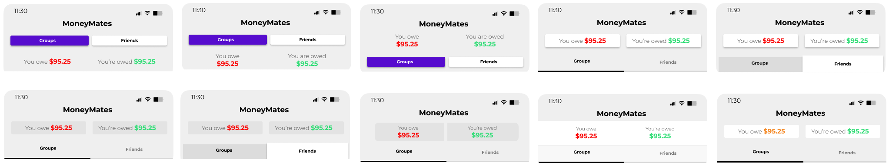

# Revisions and Iterations

## Introduction
In this section, we present the iterative design process that led to our final prototype. Building upon the initial wireframes and user flows from Assignment 2, we collaborated as a group to refine and improve the designs based on the insights gained from the design review and our collective design vision. Using the UI/UX design rules to help guide us to ensure the app is easy and functional to use.

### Navigation
- **Design Choices:** We decided between a five tab or three tab layout for our navigation. We decided on using the five tab layout as it was more effective for the user to navigate using.

We also experimented with adding colour to the navigation, highlighting the central location for the user to add items from.

### Logos Ideas
- **Design Choices:** Elliott created some mock up logos for the app, providing us potential options we could use.

### Icons
- **Design Choices:** As a group we determined which icons we thought would be best to use across the app, and also within the navigation. The icons across the app were updated as required.

### Colour Scheme
- **Design Choices:** Selected a color scheme that is both visually appealing and accessible. The colors were chosen to ensure readability and a pleasant user experience. The primary colour of purple was chosen as it is associated with wealth and finance.

### Header Designs
- **Design Choices:** Designs were created to determine which design works best, while following the UI/UX design rules. Here Dillon created several potential ideas to use for the "Manage" tab in the app.

Here we applied the colour scheme to the header designs to determine which was the most appealing to a user.

### Activity Page Content
- **Design Choices:** Designs were created for the activity page, with the content on each individual group. What quick information should be shown to the user before they proceed to tap on the group to show all the associated expense and group information.

### Manage Page Content
- **Design Choices:** Layouts were created for the activity page by Dillon, with the content for each group being displayed without having to go searching for it.

Here we Felix further iterated upon the idea.

### Manage Page Flow
- **Design Choices:** The "Manage" page user flow was iterated upon and revised several times after brainstorming. Trying to achieve the most effective method for the user to add groups, add expenses the the group and add friends.

## Design Rationale
- **Consistency:** Maintained a consistent design language throughout the app to ensure a smooth user experience.
- **Usability:** Focused on making key features easily accessible and simple to use.
- **Feedback Integration:** Incorporated feedback from initial brainstorming sessions and evaluations to refine the wireframes and user flows.