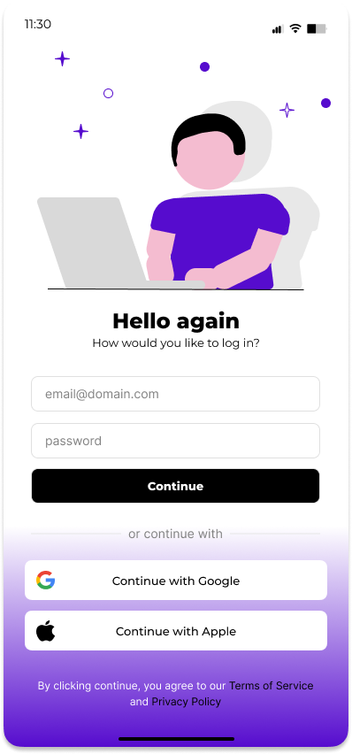

# Prototype

## Prototype URL
https://www.figma.com/proto/7yPqz8OkOydUZzwXjxEDfI/Merging-Wireframes?page-id=117%3A34&node-id=125-187&viewport=3178%2C581%2C0.45&t=tew1TNf8q617GfXO-1&scaling=min-zoom&starting-point-node-id=125%3A187&show-proto-sidebar=1

## Portotype Description

The get started gives you the option to "Log in" or "Sign Up".

If you click on "Sign Up" you get taken to this page which requires you to fill in some information and set up a password, there is also the option so sign up using Google or Apple.

If you click on "Log In" this is the page which asks for your email and password, or to log in using Apple or Google.

Once Logged in you are taken to the main screen, which is the manage tab. In here if you have no groups it will look like so with a button to create groupe located in the middle in purple. Other noticeable things are the groups and friends tabs at the top which you can actually swipe left and right between the two. As welll as the hot bar at the bottom with 5 buttons: Manage, Analytics, Add, Activity, Profile.

After clicking on the purple "+Create new group" button you are taken to a tab to create said group. At the top would be the default icon for a group with a plus which allows you to modify this image to your liking. There is a space to insert a name for the group, a space for a description, and a search bar. This search bar is look up the name of a friend that is in your friends list, there is a filter icon which allows you to narrow down your searching.
Beneath it is the members you have currently added to your group with a button that allows you to remove them if unwanted from the group. Beneath that again is a list of all your friends in alphabetical order which you can scroll through. In the top left is "Back" with an arrow, this would just take you back to the groups tab. At the top right is "Done" which you click once you have completed all the steps required for creating a group ("Done" is in the prototype however this image is missing it).

After clicking "Done" you would be taken back to the group tab as well, however this time the group you created will appear at the top. You will see the icon/image you selected for that group, as well as the avatar of the first three people in that group. If there are none, none would be shown, if one then one and so on... The words" No expenses" will be seen as well since there have been no expenses added to that group, and finally on the right is a right pointing arrow to invite the user to click on the group.

Clicking on the group will take you to the information relating to said group.This includes the name at the top, the icon underneath which you can easily edit by clicking it. The description you wrote, the list of memebers with a big plus to signal where to click o add a member to this group, and finally an area for where the expenses created for this group will be displayed (none at the moment). Instead a message saying "No expenses" and "Add an expense" are visible, the latter actually being a button that takes you to the Add expense tab.

