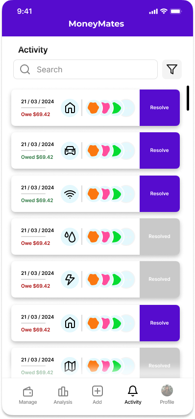
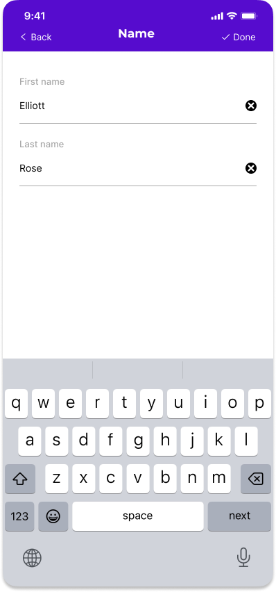
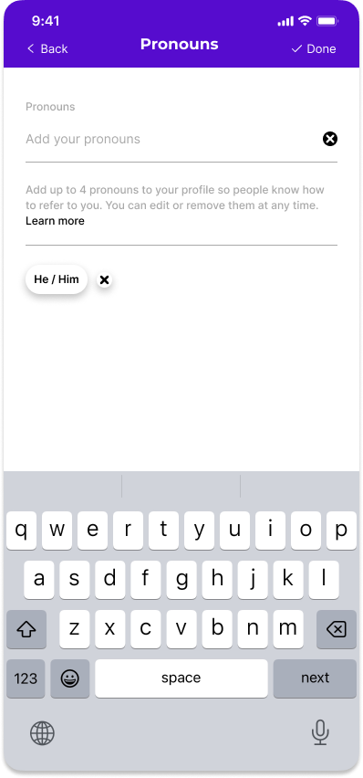
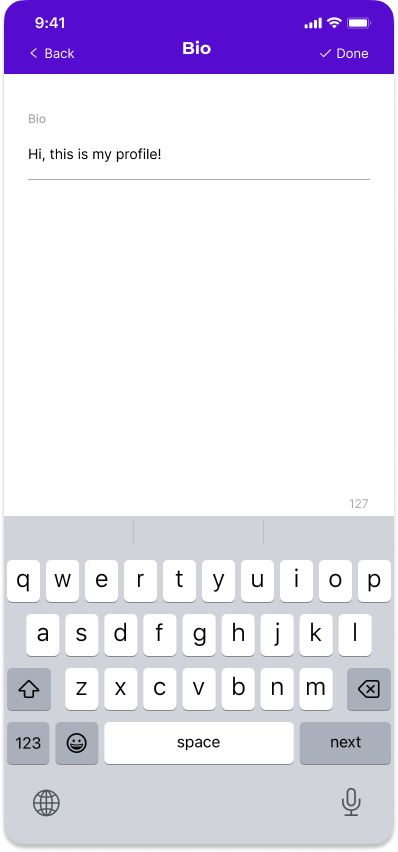
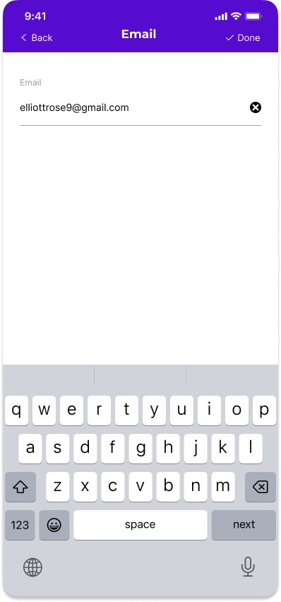
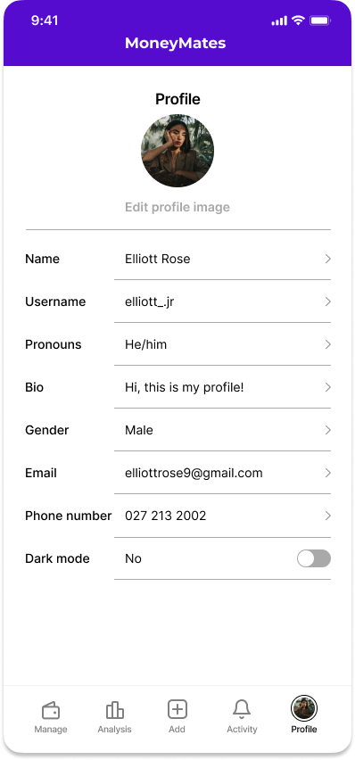

# Prototype

### Prototype URL

The link to the Figma prototype is as follows:
https://www.figma.com/proto/7yPqz8OkOydUZzwXjxEDfI/Merging-Wireframes?page-id=117%3A34&node-id=125-187&viewport=3178%2C581%2C0.45&t=tew1TNf8q617GfXO-1&scaling=min-zoom&starting-point-node-id=125%3A187&show-proto-sidebar=1

## Prototype Description

The get started gives you the option to "Log in" or "Sign Up".

If you click on "Sign Up" you get taken to this page which requires you to fill in some information and set up a password, there is also the option so sign up using Google or Apple.

If you click on "Log In" this is the page which asks for your email and password, or to log in using Apple or Google.

Once Logged in you are taken to the main screen, which is the manage tab. In here if you have no groups it will look like so with a button to create groupe located in the middle in purple. Other noticeable things are the groups and friends tabs at the top which you can actually swipe left and right between the two. As welll as the hot bar at the bottom with 5 buttons: Manage, Analytics, Add, Activity, Profile.

After clicking on the purple "+Create new group" button you are taken to a tab to create said group. At the top would be the default icon for a group with a plus which allows you to modify this image to your liking. There is a space to insert a name for the group, a space for a description, and a search bar. This search bar is look up the name of a friend that is in your friends list, there is a filter icon which allows you to narrow down your searching.
Beneath it is the members you have currently added to your group with a button that allows you to remove them if unwanted from the group. Beneath that again is a list of all your friends in alphabetical order which you can scroll through. In the top left is "Back" with an arrow, this would just take you back to the groups tab. At the top right is "Done" which you click once you have completed all the steps required for creating a group ("Done" is in the prototype however this image is missing it).

After clicking "Done" you would be taken back to the group tab as well, however this time the group you created will appear at the top. You will see the icon/image you selected for that group, as well as the avatar of the first three people in that group. If there are none, none would be shown, if one then one and so on... The words" No expenses" will be seen as well since there have been no expenses added to that group, and finally on the right is a right pointing arrow to invite the user to click on the group.

Clicking on the group will take you to the information relating to said group.This includes the name at the top, the icon underneath which you can easily edit by clicking it. The description you wrote, the list of memebers with a big plus to signal where to click o add a member to this group, and finally an area for where the expenses created for this group will be displayed (none at the moment). Instead a message saying "No expenses" and "Add an expense" are visible, the latter actually being a button that takes you to the Add expense tab.

When clicking on the "add expense" text or the Add button on the bottom on the hot bar, you get taken to the "Add expense" tab. This tab starts off with a search bar with a filter that allows you to look up a specific group that you want to add the expense to. Beneath is a horizontally scrollable tab with widgets of each group you have. By default the group you are in when clicking add expense will be selected but you can choose specifically which group you would like by simply clicking on the group when scrolling.
Beneath is the information about the expense including: A description, the amount, and the date of the expense. You can change the type of expense by clicking on the icon next to "Descripton" and you can change the type of currency by clicking on the icon next to the "amount". After that is the splitting function, which starts off with three buttons that allow you to switch between ways of splitting the expense including: Manually, Percentage and Equally. Underneath is then listed all the memebers of the group you previously selected showing the amount you assigned to each. If you would like to modify the shares you can click on the amount and a keyboard will pop to allow you to enter the desired amount. At the bottom is the "save expense" button.

Once you clicked the "Save expense" you are taken back to the group the expense was added to which is the same as the specific group tab however this time the Expenses are now listed in the area that was previously blank andeach expense is clickable to take you to an information page about the expense.

In the expense viewer tab you see the information related to the specific expense such as: The Name of the expense, the date it was set to, to buttons tat allow you to Resolve or Delete the expense, a breakdown of the Expense saying who paid for the expense and then a list of all the people involved and who still owes money and who has settled their debt. Beneath that is then a "History" area that lists all the activity in this expense such as when someone has settled their debt. In the top right is an edit button that would allow you to edit the expense if you would like to change them amount that was due or add new people to the expense.

From the expense viewer, once you click back and go back to the Group tab and then proceed to click on the "plus" sign next to the Members in the group it takes you to the following page.

In this tab you have a search bar with filter to look up people that are in your "Friends". Beneath is the current memebers in the group we are in and beneath is the list of your remaining friends that are not in the group. If you click on the "Select" on a friend it will then ask you to confirm to add siad friend:

If you would like to remove a friend you click on the icon of the desired member you would like to remove and then a similar pop out will appear:

If you are missing a friend, as in you would like to add someone but they are not in your firends list there is the button "Add new friend" located beneath the list of friends, clicking it takes you to the following:

In here is a search and filter that allows you to look up a person that uses the app with their email or username. A few options are given in a list beneath and once you have found the desired person you would like to add as friend you click on the "add" button which then comes up with a pop to confirm:

Clicking back takes us to the add members and clicking back again takes us to the specific group tab and clicking it again takes us to the "Groups" tab where all your groups are listed. Since we have ceated one group which now contains an expense it looks as follows:

This is the same as before except that now the group tab doesn't say "No expenses" but instead specifies the net amount that you are owed or that you owe accross all the expenses in the group, allowing you to see if you are up or down money in that group. Another thing is the widget expends to include a drop down that will list the top three people that either owe you or that you owe to. This is limited to three and then "..." to avoid being too large. We will now take a look at he "Friends" tab which we access by either clicking the button at the top right or by simply swiping right on your screen.

In this tab is located all of your friends that you have in the app. each shows the net amount that you owe or that they owe you, allowing you to quickly see who it is you actually owe money to. There is a search feature again to look up a specific friend and also an "Add new friend" button which takes you to the tab previously mentioned. Now we will explore the hot bar by clicking the "analytics icon".

This tab has a lot of information regarding you in the app. At the top is the total amount you owe and are due acroos all groups and expenses. Below are the top three friends that owe you money and that you owe money to. Then is a pie chart showing the spread of the amount spent on each type of expense, and then is a bar graph that shows you your personal expenses history. This is able to switch between monthly, weekly and daily. and finally is another bar graph showing the spendings of a specific group, you can either select which group to view and also which category to view, by default those will be to "All categories".

Clicking on the icon "Activity" takes us to this tab which includes a list of all the new expenses added in all groups order in chronological order. There is a search and filter feature to help you locate a specific one. Each widget showes you the amount you owe or are owed in that expense and waht group it is in as well as some of the avatars of the group members. On the right of each is a resolve button to allow you to settle a debt immediatly from the activity tab without having to go all the way into the group and into that expense. However clicking the widget will also take you to that expense inforamtion tab. Clicking on resolve will bring up a pop up as follows:

by clicking confirm the purple "resolve" button fades to a grey. If you would like to unresolve the expense clicking on the grey out button will show with the following pop up:

Finally is the profile icon in the bottom right of the hot bar. this takes you to the following:

This is all the information regarding you. Each information can be clicked on which takes you to a page to modify said information. Clicking on your avatar brings up a pop up:

Clicking on "Name" :

Clicking on "Username" :

Clicking on "Pronouns" :

Clicking on "Bio" :

Clicking on "Gender" :

Clicking on "Email" :

Clicking on "Phone number" :

and then you get a more filled in profile as follows, the last button is a switch to go between dark and light mode for the app.

