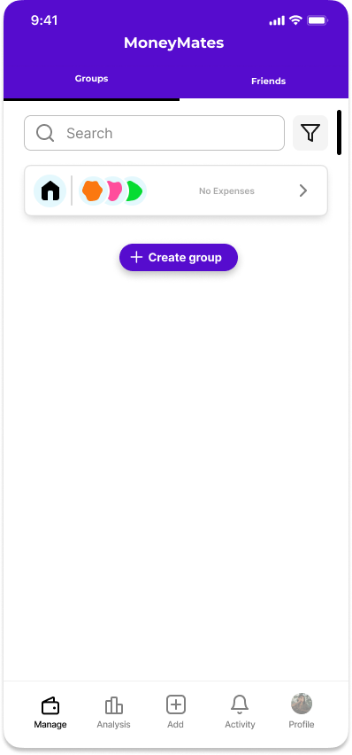
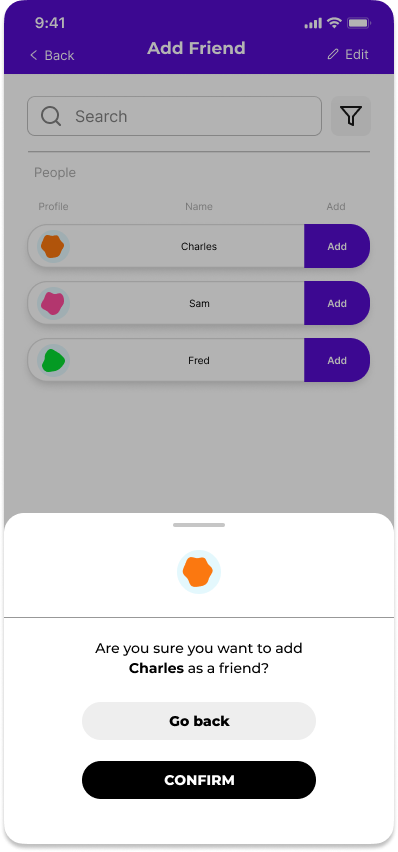
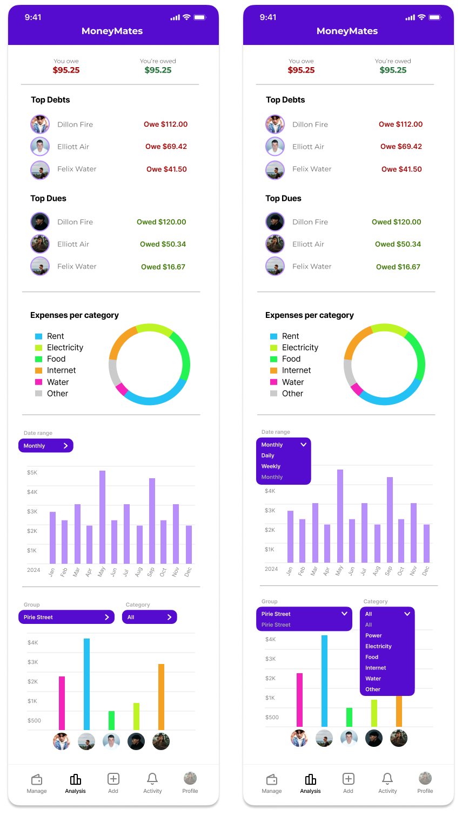
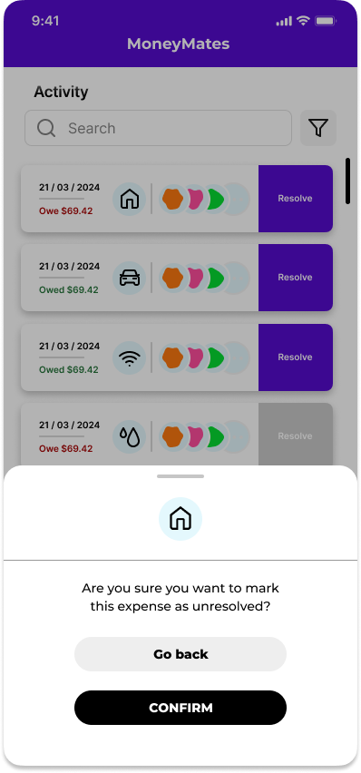
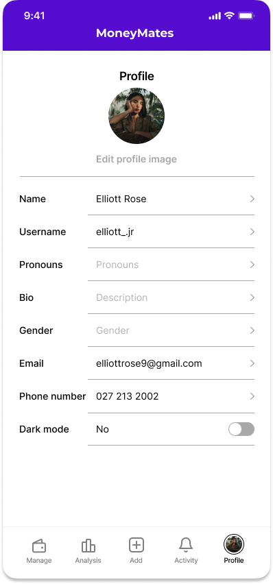
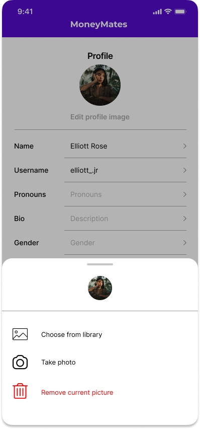
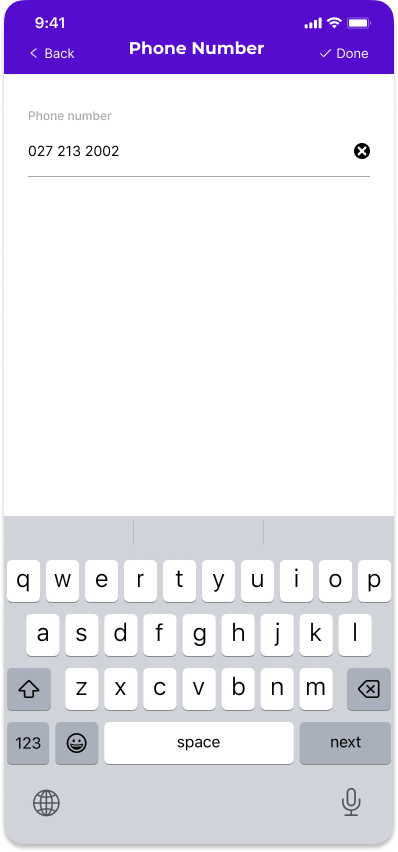

# Prototype

### Prototype URL

The link to the Figma prototype is as follows:
https://www.figma.com/proto/7yPqz8OkOydUZzwXjxEDfI/Merging-Wireframes?page-id=117%3A34&node-id=125-187&viewport=3178%2C581%2C0.45&t=tew1TNf8q617GfXO-1&scaling=min-zoom&starting-point-node-id=125%3A187&show-proto-sidebar=1

## Prototype Description

When opening the app, the user is presented with the getting started screen, offering the options to "Log In" or "Sign Up".

Clicking "Sign Up" will take you to the page below, where you'll need to provide information to create a new account. Options to sign up using Google or Apple are also offered, making the process smoother and more convenient.

When clicking "Log In," the screen below is shown, requesting the user's email and password.

Once logged in, you are taken to the main "Manage" tab. If no groups have been created, it will display only a button to create a group. The tabs located at the top, "Groups" and "Friends," allow the user to swipe left and right between the two. At the bottom, there is a hot bar with five buttons: "Manage," "Analytics," "Add," "Activity," and "Profile."

After clicking on the purple "+ Create new group" button, you are taken to a tab to create the group. At the top is the selected icon for the group, with a plus sign allowing you to modify it to your liking (e.g., a water drop for water bills, a light bulb for electricity bills, etc.). There are text fields for the group name and description, as well as a search bar. This search bar allows you to look up the name of a friend from your friends list, with a filter to narrow down your search.

Beneath the search bar are the members you have currently added to your group, with a button to remove any unwanted members. Below that is a list of all your friends in alphabetical order, which you can scroll through. In the top left is a "Back" button with an arrow, which takes you back to the groups tab. In the top right is a "Done" button, which you click once you have completed all the steps required for creating a group.

After clicking "Done", you will be taken back to the group view, where you can see the newly created group. The selected icon or image for that group will be displayed, along with the avatars of the first three members. If there are no members yet, no avatars will be shown. The text "No expenses" will appear, indicating that no expenses have been added to the group yet.

Tapping on the group will reveal its information. At the top, you'll see the group's name, followed by an editable icon below it. There's also the description you've provided and a list of members, with a prominent plus sign indicating where to click to add a new member to the group. At the bottom, there’s a section where expenses for this group will be displayed (currently empty). Instead of expenses, you'll see a message that says "No expenses" along with a button labeled "Add an expense," which redirects you to the Add Expense tab.

When you click on the "Add expense" text or the Add button in the bottom hot bar, you will be taken to the "Add expense" tab. This tab begins with a search bar and a filter, allowing you to search for a specific group to which you want to add the expense. Below the search bar is a horizontally scrollable section displaying widgets for each group you have. By default, the group you were in when you clicked "add expense" will be selected, but you can choose a different group by simply clicking on it while scrolling.

Below that, you'll find the expense information fields, including a description, the amount, and the date of the expense. You can change the type of expense by clicking on the icon next to "Description" and change the currency type by clicking on the icon next to "Amount." Next, you'll see the splitting function with three buttons allowing you to choose how to split the expense: manually, by percentage, or equally. Beneath this, all the members of the selected group are listed, showing the amount assigned to each. To modify the shares, you can click on the amount, which will bring up a keyboard for entering the desired amount. At the bottom of the tab is the "Save expense" button.

Once you click "Save expense," you are taken back to the group where the expense was added. This view is similar to the specific group tab, but now the expenses are listed in the previously blank area. Each expense is clickable, taking you to an information page about that expense.

In the expense viewer tab, you can see the details of the specific expense, including the name of the expense, the date it was set, and buttons to resolve or delete the expense. It also includes a breakdown of the expense, showing who paid for it, a list of all the people involved, and the status of their payments (who still owes money and who has settled their debt). Below that is a "History" section that lists all activity related to this expense, such as when someone has settled their debt. In the top right corner, there is an edit button that allows you to modify the expense, such as changing the amount due or adding new people to the expense.

From the expense viewer, if you click back and return to the Group tab, and then click on the "plus" sign next to the Members, you will be taken to the following page.

In this tab, you have a search bar with a filter to look up people in your "Friends" list. Below the search bar, you'll see the current members of the group you are in, followed by a list of your remaining friends who are not in the group. If you click "Select" on a friend, you will be prompted to confirm adding that friend to the group.

If you want to remove a friend, click on the icon of the member you wish to remove, and a similar pop-up will appear to confirm the removal.

If you are missing a friend and would like to add someone who is not in your friends list, there is an "Add new friend" button located beneath the list of friends. Clicking this button will take you to the following page.

Here, you will find a search and filter feature that allows you to look up a person who uses the app by their email or username. A list of matching options will appear below. Once you have found the person you want to add as a friend, click the "Add" button, which will prompt a confirmation pop-up.

Clicking back takes you to the add members page. Clicking back again returns you to the specific group tab. Clicking back once more takes you to the "Groups" tab, where all your groups are listed. Since we have created one group which now contains an expense, it looks as follows:

This view is similar to before, but now the group tab no longer says "No expenses." Instead, it shows the net amount you are owed or owe across all the expenses in the group, allowing you to see if you are up or down money in that group. Additionally, the widget expands to include a drop-down list displaying the top three people who either owe you money or to whom you owe money. This list is limited to three entries, followed by "..." to avoid becoming too large.

Now, let's take a look at the "Friends" tab, which you can access by either clicking the button at the top right or by swiping right on your screen.

In this tab, you will find all of your friends who are using the app. Each friend shows the net amount you owe them or they owe you, allowing you to quickly see who you actually owe money to. There is also a search feature to look up a specific friend, and an "Add new friend" button that takes you to the previously mentioned tab. Now, let's explore the hot bar by clicking on the "analytics icon."

This tab provides detailed information about your activity in the app. At the top, you'll see the total amount you owe and are due across all groups and expenses. Below that, there are sections for the top three friends who owe you money and the top three friends you owe money to.

Next, there is a pie chart displaying the distribution of the amount spent on each type of expense. Following that is a bar graph showing your personal expenses history, which you can switch between monthly, weekly, and daily views. Finally, there is another bar graph showing the spending of a specific group. You can select which group to view and choose the category to display, with the default set to "All categories."

Clicking on the "Activity" icon takes us to this tab, which includes a list of all the new expenses added across all groups, ordered chronologically. There is a search and filter feature to help you locate a specific expense. Each widget shows the amount you owe or are owed in that expense, the group it belongs to, and some avatars of the group members. On the right of each widget is a "Resolve" button, allowing you to settle a debt immediately from the activity tab without having to navigate into the group and then into the specific expense. However, clicking the widget itself will also take you to the expense information tab. Clicking on "Resolve" will bring up a pop-up as follows:

By clicking confirm, the purple "resolve" button fades to grey. If you want to unresolve the expense, clicking on the greyed-out button will bring up the following pop-up:

Finally, the profile icon in the bottom right of the hot bar takes you to the following page:

This page contains all the user's information in a central location. Each field is clickable and takes the user to a page where they can modify that specific information. Clicking on your avatar brings up a pop-up to change the profile photo.

Clicking on "Name" will take you to a page where you can update your name.

Clicking on "Username" will take you to a page where you can update your username.

Clicking on "Pronouns" will take you to a page where you can update your pronouns.

Clicking on "Bio" will take you to a page where you can update your bio.

Clicking on "Gender" will take you to a page where you can update your gender.

Clicking on "Email" will take you to a page where you can update your email.

Clicking on "Phone number" will take you to a page where you can update your phone number.

The below image displays filled-in profile page. The last button on this page is a switch to toggle between dark and light mode for the app.

